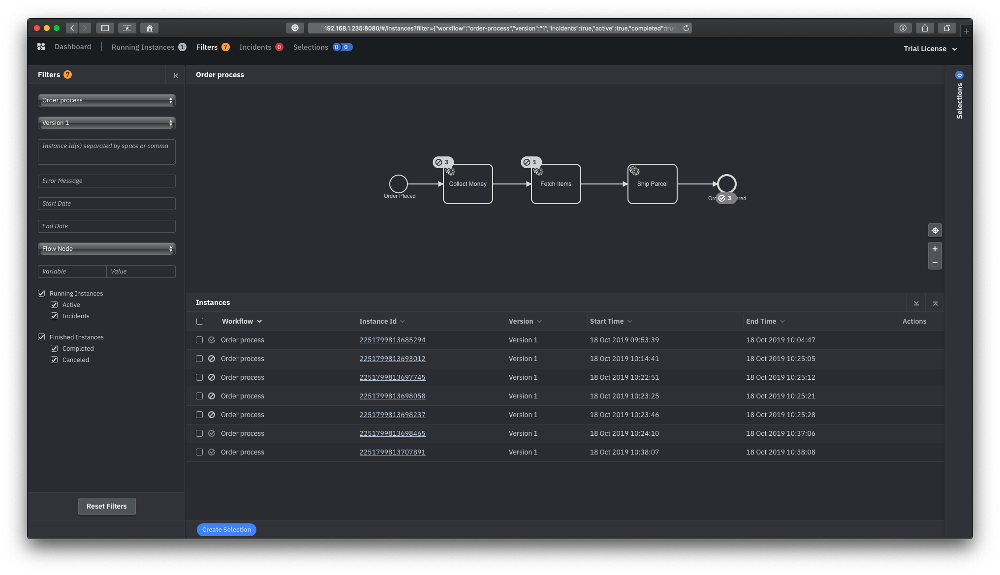

# bss-zeebe-java
Zeebe example with java

## Install Zeebe
https://docs.zeebe.io/introduction/install.html

Make sure ports below is working
```
26500: Gateway API (Importance for client)
26501: Command API (gateway-to-broker)
26502: Internal API (broker-to-broker)
```

## Java client
https://docs.zeebe.io/java-client/get-started.html

### Run jar file
Run `mvn package`, and it will generate a JAR file in the target subdirectory. You can run this with `java -jar target/${JAR file}`

## Preview
